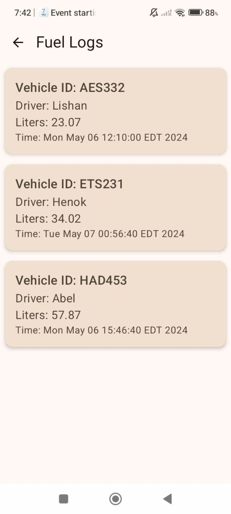

# 🚐 GondarTour Android App

**GondarTour** is an Android application built with Kotlin, Jetpack Compose, and Hilt. It is designed for tourist guiding companies to track vehicle locations and manage fuel consumption efficiently.

---

## 📱 Features

* 🗺️ Real-time Google Map vehicle tracking
* ⛽ Fuel log recording with timestamps
* 📍 Custom vehicle marker icons
* 🔄 Jump between vehicles with map focus
* 🧭 Location permission handling
* 🔐 Hilt dependency injection
* 🗃️ Room database for offline fuel log storage
* 🔗 Retrofit integration for backend communication

---

## 📸 Screenshots

> Screenshots:

| Driver Dashboard | Fuel Logs |
| ---------------- | --------- |
|  |  |
|  |  |

---

## 🏗️ Architecture

* **MVVM** pattern (Model-View-ViewModel)
* **Hilt** for dependency injection
* **Room** for local persistence
* **Jetpack Compose** for UI

---

## 🔧 Setup Instructions

1. **Clone the repository**

   ```bash
   git clone https://github.com/Lishaneticha/GondarTour.git
   ```

2. **Open in Android Studio**

3. **Add Google Maps API Key Securely**

   In the root `local.properties` file (not pushed to Git):

   ```properties
   MAPS_API_KEY=your_actual_google_maps_api_key
   ```

   In `build.gradle.kts` (app-level):

   ```kotlin
   val localProperties = java.util.Properties().apply {
       val localPropsFile = rootProject.file("local.properties")
       if (localPropsFile.exists()) {
           localPropsFile.inputStream().use { load(it) }
       }
   }

   val mapsApiKey = localProperties.getProperty("MAPS_API_KEY") ?: ""

   android {
       defaultConfig {
           resValue("string", "google_maps_key", mapsApiKey)
       }
   }
   ```

   Then reference it in `AndroidManifest.xml`:

   ```xml
   <meta-data
       android:name="com.google.android.geo.API_KEY"
       android:value="@string/google_maps_key" />
   ```

4. **Run the app** on an emulator or device.

---

## 📦 Dependencies

* Jetpack Compose
* Hilt
* Retrofit
* Room
* Google Maps SDK for Android
* Accompanist Permissions

---

## 🛡️ Permissions

* `ACCESS_FINE_LOCATION`
* `ACCESS_COARSE_LOCATION`
* `INTERNET`
* `ACCESS_NETWORK_STATE`

---

## 🙋 Contributing

Feel free to fork this repo and submit pull requests! For major changes, please open an issue first.

---

## 📦 Download

[⬇️ Download Latest APK](https://drive.google.com/file/d/1i6Y0_siX7VQxwyrIRRI1vAVhzWs33i1K/view?usp=sharing)

---

## 📄 License

This project is licensed under the MIT License.

---

## 🔗 Contact

Created by **Lishan Eticha Geleta**  ·  [@Lishaneticha](https://github.com/Lishaneticha)

